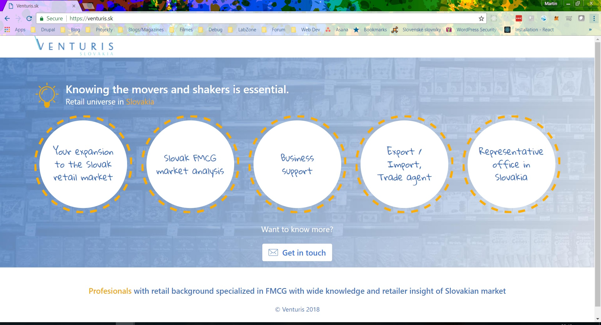

# VENTURIS SLOVAKIA

Repository for static HTML site for [VENTURIS SLOVAKIA](https://venturis.sk) company. Site is created as single page with contact form. For contact form processing is used PHP on server side.

List of used technologies:

- HTML5
- JavaScript
- SASS 
- Gulp

Gulp is used to:

- Minify CSS and JS
- Optimize images
- Find CSS Critical Path

##Screenshot

If you have any comments or questions, please do not hesitate to contact me on Twitter: [@starosta83](https://twitter.com/starosta83)

